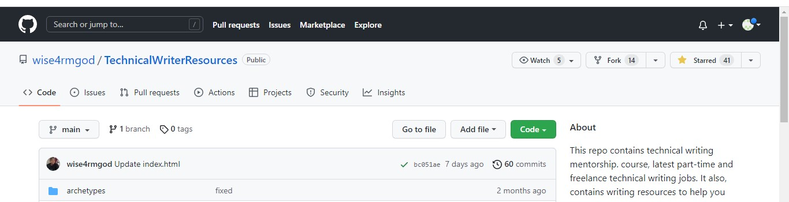
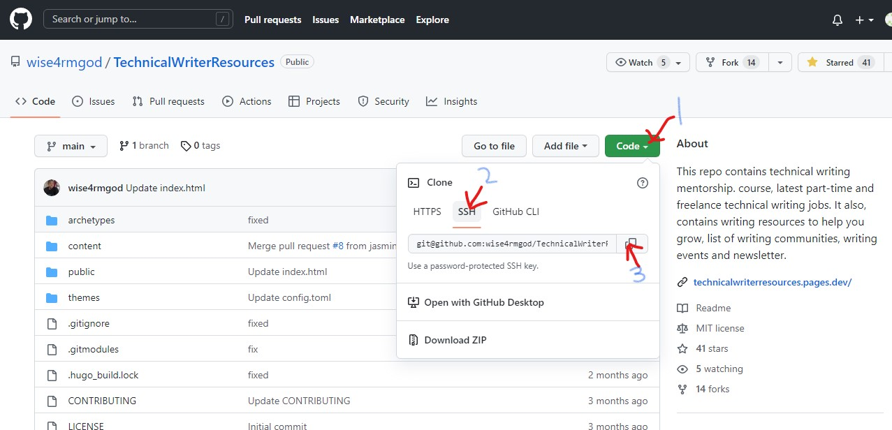
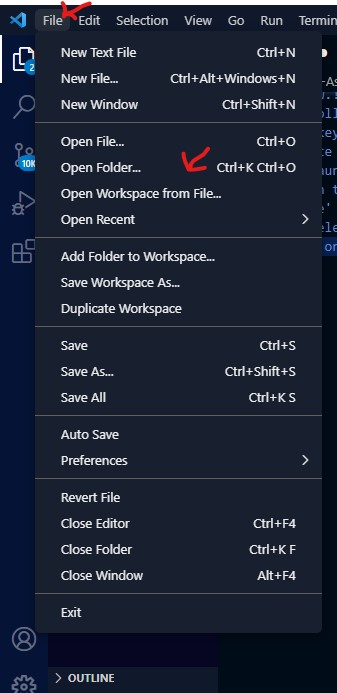
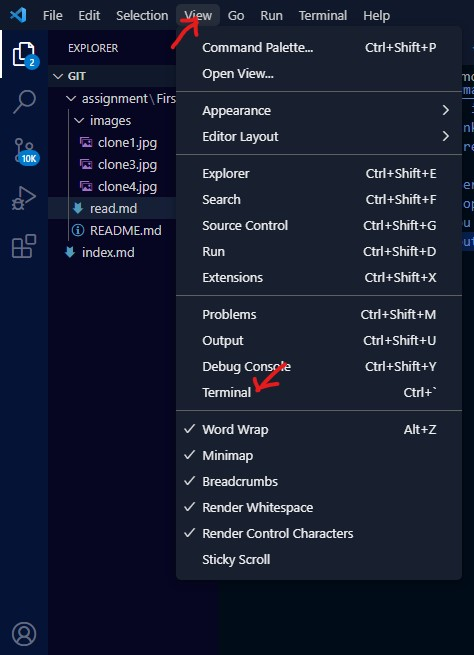
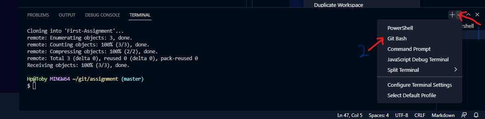
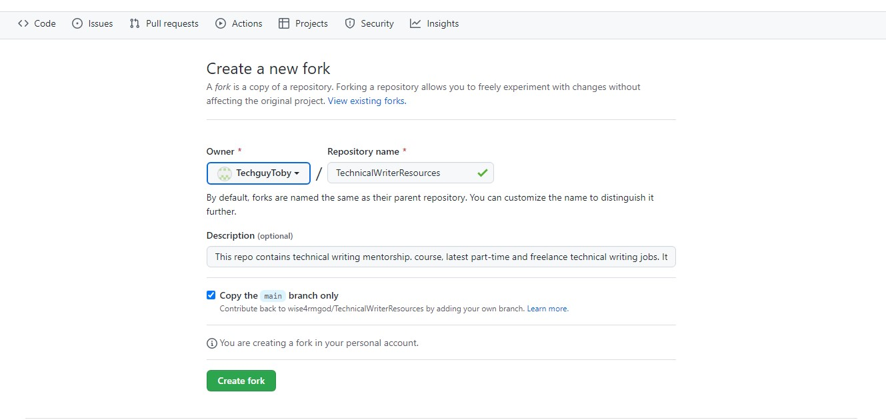

# Introduction to GitHub

## Table of contents
1. Introduction
2. What is GitHub?
3. Why GitHub?
4. Git vs GitHub
5. How to clone
6. How to make a pull request
7. How to do a commit
8. Github desktop vs Github CLI
9. Conclusion
    

## Introduction 

In a world of technological advancement and socio-economic growth, it was only a matter of time before the need for remote access to and control of activities arose.

Like every organization with foresight,  [Github](https://anvilproject.org/guides/content/creating-links) (a means to ease version control and tracking of software developments) was collectively founded in 2008 by **Chris Wanstrath**, **P.J. Hyett**, **Scott Chacon**, and **Tom Preston-Werner**. This company will later grow to be a universally accepted platform to connect professionals beyond borders, help recruiters find talented individuals and generally showcase the individual and collective efforts to the success of a project. 

## What is Github?
I had the perception that Github is a social media platform for programmers and tech-inclined individuals alike. The truth is, Github is the aforementioned and more. It is an online, cloud-based, software development platform used by tech professionals to collaborate on software projects, store software data and keep track of changes made in real-time. GitHub can be used as a social site by developers to connect, as well as a free platform for developers to showcase their skills and talents.

## Why GitHub?
The reason GitHub users choose it is many but the major reasons are; its large and growing user base gives developers insights and exposure, it allows real-time change effect, it connects developers of varying backgrounds beyond borders, and it enhances collaboration.

## Git vs GitHub

[Git](https://blog.hubspot.com/website/what-is-github-used-for) is an open-source version control software. It is used for managing and tracking changes in files. like every version control software, Git highlights the changes made in a file and also keeps a history of all actions done on the file. 

GitHub, on the other hand, is a platform that utilises Git technology to help developers work together on projects with each contributor seeing his input and also keeping track of individual performance. 

## How to clone
Cloning in the actual sense means making a copy of something. Cloning in Github requires a developer to make a copy of a repository(file or folder) on GitHub to your local computer. By making a clone, a developer can effect changes to the cloned repository without affecting the original repository on GitHub, this is how various developers can work on the same project without interfering with each other's work.

Follow these steps to clone a repository from GitHub:

1. Sign in to your GitHub account.
2. Search for the repository you wish to clone.
3. Click on the repository to show its details. For example, I can search for the repository "TechnicalWritingResources" and when I click on it, it brings up the image below.
4. Click the green button on the right labelled "Code". Doing this will display a drop-down with menu options; HTTPS, SSH, and GitHub CLI as shown in the image below.
5. Follow steps 1, 2, and 3 in the image above to copy the SSH link and you can select the HTTP. This copied link is what will be used to create a clone of this repository later on.
6. Launch your vscode.
7. On the top left corner of your screen, click on the 'File' menu and select 'Open Folder' among the options. 
8. Select the folder you will like to make the clone into on your local computer.
9. After you have opened a folder, click on the 'View' menu and select 'Terminal' among the options to open a new terminal. 
10. On the Terminal pane, click the '+' sign on the right and select 'gitbash. 
11. On the left, type the command line "git clone (paste the SSH link or HTTPS link you copied in step 5), and click enter.
12. Automatically, the link you just pasted will clone or copy everything in the repository 'TechnicalWritingResources' into your local computer.

Upon completing the steps above, you have successfully cloned a repository.

## How to make a pull request
To make a pull request means to seek permission from the owner of a repository before you publish the changes you made to their repository. Refer to the following steps to learn how to make a pull request:

1. The first step is to fork (to create a copy of a repository on the GitHub cloud) the targetted repository.  
On your forked repository, you can make any changes to it without affecting the original repository. 
2. The next step is to make a clone of the forked repository to your local computer. Refer to the "how to clone" section above to complete this step.
3. Launch your text editor
4. Open a folder to clone your repository to and open a terminal.
5. Type the command line "git checkout -b (name of the branch) and press enter to create a new branch on the repository.
6. Make the changes you wish to do to this repository and save.
7. Type the command line "git status" to see the changes you have made.
8. Then, type 'git add .' to add all the changes you have made and notify git that you will like to include those changes in the next commit.
9. Type 'git commit -m "a message explaining what the commit is about"' and press enter, then you should get a message highlighting the changes you made. This will save all changes selected or added.
10. Finally, type 'git push origin (the branch you want to push) and click enter.
11. If you have done the previous steps successfully, you should get a message stating you have made a successful push. Go back to GitHub to see your pushed branch.
12. On GitHub, on the right-hand side of the new branch, you will see a green button tagged 'compare and pull request', click it to proceed.
13. By clicking on 'compare and pull request' you have initiated a pull request, on this page you will see two bars showing your new branch with changes on the right and the Master branch published by the repository owner on the left. Below these bars is a text box, where you can add a message stating why you want to make a pull request to the owner and possibly the changes you made. Then, click 'create pull request'.
14. You have successfully created a pull request after completing step 13, all that's left is to wait for the repository author to accept your request and publish the change you made.

## How to do a commit
[Commit](https://github.com/git-guides/git-commit) is a git command used to save changes made to a local repository before the repository is pushed to the GitHub platform. You have to be specific with the changes you want to commit and also add a message of what the change is about when you implement the commit command line.

The commit syntax is:- git commit -m "a message explaining what the commit is about"

## GitHub desktop vs GitHub CLI
[GitHub Desktop](https://docs.github.com/en/desktop) is a software programme version of GitHub that can be installed on your device. You can implement most Git commands from GitHub desktop with visual confirmation of all the changes you make.
[Github CLI](https://docs.github.com/en/get-started/using-github/github-cli) is an open-source tool that allows developers to access GitHub using your computer's command line interface. You do not need to install GitHub or any software to use GitHub CLI. All you need is already on your computer.

| GitHub CLI |GitHub Desktop|
|:------------:|:----------:|
|it is good|It is not good|
|

## Conclusion
As a newbie in program development, learning how to use GitHub is an essential part of your career in program development. GitHub is basic knowledge and it is necessary to help you connect with other developers, learn from other developers, and possibly get a job opportunity.

I hope this guide was helpful to get you started on what GitHub is and how it works.
