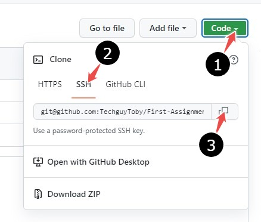
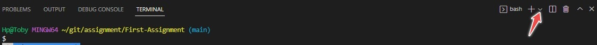

# Introduction to GitHub

## Table of contents
1. Introduction
2. What is GitHub?
3. Why GitHub?
4. Git vs GitHub
5. How to clone
6. How to make a pull request
7. How to do a commit
8. Github desktop vs Github CLI
9. Conclusion
    

## Introduction 

In a world of technological advancement and socio-economic growth, it was only a matter of time before the need for remote access to and control of activities arose.

Like every organization with foresight,  [Github](https://anvilproject.org/guides/content/creating-links) (a way to ease version control and tracking of software developments) was collectively founded in 2008 by **Chris Wanstrath**, **P.J. Hyett**, **Scott Chacon**, and **Tom Preston-Werner**. This company will later grow to be a universally accepted platform to connect professionals beyond borders, help recruiters find talented individuals, and generally showcase the individual and collective efforts that contribute to the success of a project. 

## What is Github?
I had the perception that Github was a social media platform for programmers and tech-inclined individuals alike. The truth is, Github is all of the aforementioned and more. It is an online, cloud-based software development platform used by tech professionals to collaborate on software projects, store software data, and keep track of changes made in real time. GitHub can be used as a social site by developers to connect, as well as a free platform for developers to showcase their skills and talents.

## Why GitHub?
The reasons GitHub users choose it are many, but the major reasons are: 
* its large and growing user base gives developers insights and exposure 
* it allows real-time change effects
* it connects developers of varying backgrounds beyond borders
*  it enhances collaboration

## Git vs GitHub

[Git](https://blog.hubspot.com/website/what-is-github-used-for) is an open-source version control software. It is used for managing and tracking changes in files. Like every version control software, Git highlights the changes made in a file and also keeps a history of all actions done on the file. 

GitHub, on the other hand, is a platform that utilises Git technology to help developers work together on projects, with each contributor seeing his input and also keeping track of individual performance. 

|Git|GitHub
|---|-----|
|It is an open-source version control system.|It is a platform that utilises Git technology to connect developers.|
|It is an installed software.|It is a cloud-based platform.|
|It makes branching easy.|It makes remote collaboration possible.|
|It supports non-linear development.|It displays real-time changes to all contributors.|
|It is used to make changes to repositories and also record changes in a repository.|It manages and keeps track of changes in a repository.|
## How to clone
Cloning, in the actual sense, means making a copy of something. Cloning from GitHub requires a developer to make a local copy of a repository(file or folder) on GitHub. By making a clone, a developer can make changes to the cloned repository without affecting the original repository on GitHub. This is how various developers can work on the same project without interfering with each other's work.

Follow these steps to clone a repository from GitHub to your Windows computer:

1. Sign in to your GitHub account.
2. Search for the repository you wish to clone.
3. Click on the repository to show its details. For example, I can search for the repository **First Assignment** and when I click on it, it brings up the image below.
4. Click the green button on the right labelled **Code**. Doing this will display a drop-down with menu options; **HTTPS**, **SSH**, and **GitHub CLI** as shown in the image below.
5. Follow points 1-3 in the image above to copy the **SSH** link. This copied link is what will be used later to create a clone of this repository.
6. Launch **Vscode** on your computer; this example is done on Windows.
7. On the top left corner of your screen, click on the **File** menu and select **Open Folder** from the list of options. 
8. Select the folder you would like to make the clone into on your local computer. As seen in the image above.
9. After you have opened a folder, click on the **View** menu as shown below and select **Terminal** among the options to open a new terminal. 
10. In the Terminal pane, select **Gitbash** by clicking the **+** sign on the right. 
11. On the left, type **git clone** (paste the SSH link you copied in step 5), and press enter.
12. Completing the action above will automatically clone the contents of the repository **First Assignment** onto your local computer.

Upon completing the steps above, you have successfully cloned a repository.

## How to make a pull request
To make a pull request means seeking permission from the owner of the repository you made changes to. Refer to the following steps to learn how to make a pull request on Windows:

1. The first step is to fork (to create a copy of a repository on the GitHub cloud) the target repository. Refer to the images below to create a fork of the repository.   In your forked repository, you can make any changes to it without affecting the original repository. 
2. The next step is to make a clone of the forked repository on your local computer. Refer to the **how to clone** section above to complete this step.
3. Launch a text editor, in this case, Vscode.
4. Open a folder to clone your repository and open a terminal.
5. Type the command [**git checkout -b [name of the branch]**] and press enter to create a new branch in the repository.
6. Make the changes you want to this repository and save[ctrl+s].
7. Type the command **git status** to see the changes you have made.
8. Then, type **git add .** to add all the changes you have made and notify Git that you would like to include those changes in the next commit.
9.  Type **git commit -m [a message explaining what the commit is about]** and press enter. You should get a message highlighting the changes you made. This will save all changes selected or added.
10. Finally, type **git push origin [the branch you want to push]** and click enter. 
11. If you have done the previous steps correctly, you should get a message stating you have made a successful push. Go back to GitHub to see your pushed branch.
12. On GitHub, on the right-hand side of the new branch, you will see a green button tagged **compare and pull request**. Click it to proceed. 
13. By clicking on **compare and pull request** you have initiated a pull request. On this page, you will see two bars showing your new branch with changes on the right and the master branch published by the repository owner on the left.  As seen in the image above, there is a text box where you can highlight the changes you made to the repository. Then, click **create pull request** to complete the process.
14. You have successfully created a pull request after completing step 13. All that is left is to wait for the repository author to accept your request and merge the change you made.

## How to do a commit
[Commit](https://github.com/git-guides/git-commit) is a git command used to save changes made to a local repository before the repository is pushed to the GitHub platform. You have to be specific with the changes you want to commit and also add a message about what the change is about when you implement the commit command line.

The commit syntax is **git commit -m [a message explaining what the commit is about]** as shown below

## GitHub desktop vs GitHub command line interface(CLI)
|GitHub CLI|GitHub Desktop|
|---------|----------|
|It allows users to interact with GitHub through their local computer command interface.|It allows users to interact with GitHub through a Graphic User Interface(GUI).|
|It is an open-source tool.|It is an installed software program.|
|It is recommended as the best.|It is equally good for executing commands.|
It does not require you to install the GitHub software.| You need to install the GitHub software.|
|It is fast and less time-consuming.|It consumes more time compared to GitHub CLI.|

## Conclusion
As a newbie in program development, learning how to use GitHub is an essential part of your career in program development. GitHub is basic knowledge, and it is necessary to help you connect with other developers, learn from other developers, and possibly get a job opportunity.

I hope this guide was helpful to get you started on what GitHub is and how it works.
